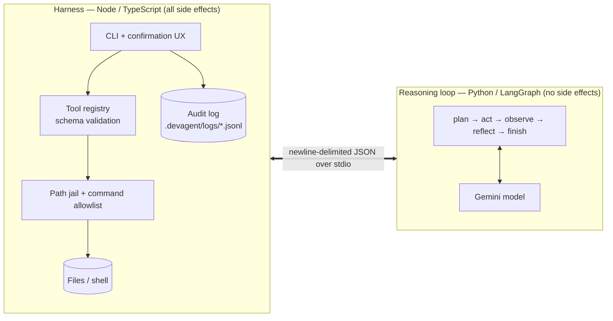

# DevAgent architecture

DevAgent is two processes with a deliberately narrow interface between them.

## Why two processes

- **The process that can do things is not the one that decides things.** The Python side never
  touches the filesystem or a shell. It can only *propose* a tool call, and the harness decides
  whether to run it. A confused or manipulated model can ask for something bad; it cannot do it.
- **The boundary is a protocol, not an import.** Each side can be tested without the other, and
  the model can be swapped for a scripted fake — which is how the whole system is tested without
  an API key.

## The protocol

One JSON object per line over the child process's stdin/stdout. Every message is an envelope
(`v`, `id`, `session_id`, `ts`, `type`, `payload`) validated against JSON Schemas in `schemas/`
that **both** sides load — so the two implementations cannot silently drift apart.

| Type | Direction | Meaning |
|---|---|---|
| `ping` / `pong` | both | startup health check |
| `task_start` | harness → loop | the task, repo path, iteration budget, model |
| `plan_update` | loop → harness | streamed status ("planning", "calling_tool", …) for live display |
| `tool_call` / `tool_result` | loop → harness / back | a proposed action and its outcome |
| `ask_user` / `ask_user_response` | loop → harness / back | a free-text question and the human's answer |
| `final_answer` | loop → harness | the result |
| `error` | either | protocol violations and unrecoverable task errors |

Framing is plain NDJSON with a byte-level line buffer (so a UTF-8 character split across reads
can't corrupt a message) and a max-line-size guard.

## The reasoning loop

A LangGraph state machine: `plan` (call the model) → `act` (propose a tool call) → `observe`
(feed the result back) → `reflect` (continue or stop on the iteration budget) → `finish`.

`act` calls LangGraph's `interrupt()`, which pauses the graph and hands the proposed call back to
the caller; the harness executes it and the graph resumes with the result. That pause is the
mechanism that keeps the reasoning loop side-effect-free: the only way out of `act` is through the
harness. A failed tool call is not an exception — it becomes an `{ok:false}` observation the model
sees and can recover from, which is what "replan on failure" means here. `ask_user` rides the same
mechanism; only `__main__.py` knows it's special, so the graph needed no changes to support it.

Model calls retry on per-minute rate limits (honoring the provider's suggested wait) and fail fast
on hard quotas.

## Safety model (and its honest limits)

| Layer | Protects against | Where |
|---|---|---|
| Schema validation of every tool call | malformed or unexpected arguments | harness registry |
| Path jail (incl. symlink check) | file tools reaching outside the repo | `pathJail.ts` |
| Command allowlist (command + arg prefixes) | running anything not explicitly approved | `commandAllowlist.ts` |
| No shell | command injection via `; && \| >` | `runCommand.ts` |
| Restricted environment | leaking API keys to child commands | `runCommand.ts` |
| Timeout + process-tree kill, output caps | hung or runaway commands | `runCommand.ts` |
| Plan/commit split + confirmation | unreviewed writes and commands | `writePlan.ts`, `cli.ts` |

**Limits.** This is rule-based safety on an ordinary process, not OS-level isolation: an
allowlisted command that misbehaves within its own normal abilities inside the repo is not stopped.
The jail is exact for file-tool paths but only best-effort for `run_command` arguments (they're
opaque per-tool flags, so the allowlist — which excludes general-purpose file programs — carries
that weight). Container/VM isolation was a deliberate non-goal: it would add required software and
break the "clone and run" install.

## Observability

Every message in both directions is appended to `.devagent/logs/<session>.jsonl`, with session
start/end records. `devagent replay` renders a log as a transcript (read-only inspection; live
resume of a session is not implemented). `--verbose` echoes raw protocol traffic to stderr.

## Testing strategy

- Pure units (framing, schema validation, path jail, allowlist, diff/plan logic) tested in
  isolation, on both sides of the boundary.
- A scripted fake model (`DEVAGENT_FAKE_LLM_RESPONSES`) lets integration tests spawn the *real*
  Python process, speak the *real* protocol, and run *real* tools — with no API key.
- The built CLI is driven as a subprocess with piped stdin to test the interactive paths
  (confirm, decline, `--yolo`, `ask_user`, multi-step, crash recovery, replay).
- `benchmark/` runs the real CLI against fixture repos with real bugs, verified by their own tests.
